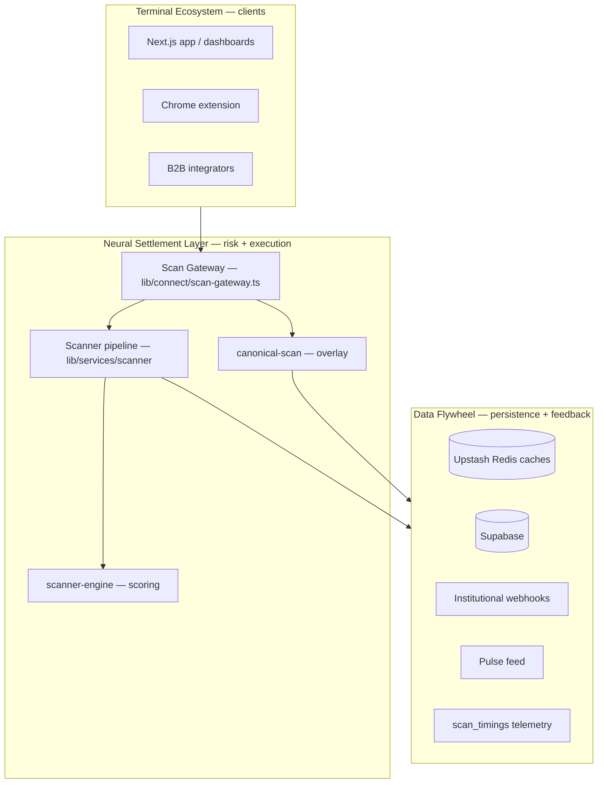
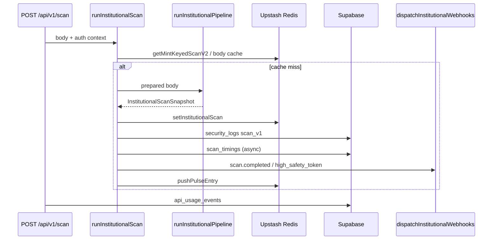
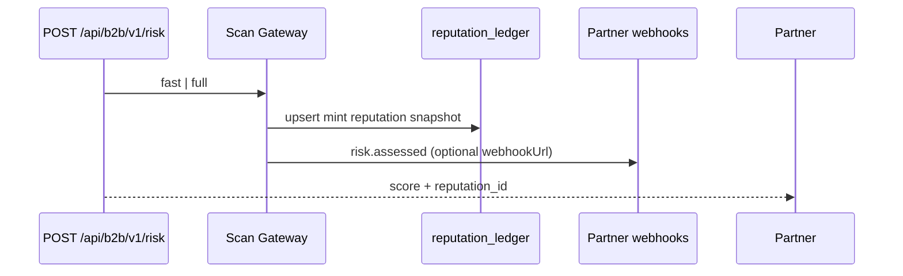

# CryptoCheck AI — System architecture

**Onboarding guide for engineers**  
**Last updated:** 2026-05-29 (Sprint 1 — fast pipeline, async canonical, `@cryptocheck/types`)

This document describes the **target three-layer architecture**, how the **current codebase** maps to it today, and what remains before the migration is complete. See also:

- `docs/coupling-delta.md` — scanner decoupling scorecard  
- `docs/latency-regression.md` — P50/P95 methodology  
- `docs/package-boundary-audit.md` — `packages/` hygiene  
- `docs/b2b-smoke-test-results.md` — partner API smoke status  

---

## 1. Three-layer model



| Layer | Responsibility | Current location | Migration status |
|-------|----------------|------------------|------------------|
| **Neural Settlement Layer** | Token risk assessment, swap simulation, verdict/score | `lib/services/scanner/*`, `lib/services/scanner-engine.ts`, `lib/sentinel/*`, `lib/connect/*` | Gateway + fast pipeline landed; engine frozen |
| **Terminal Ecosystem** | UX: intelligence terminal, pro dashboard, extension | `app/dashboard/*`, `app/pro/*`, `packages/extension/` | Pro UI uses `@cryptocheck/types`; data via API/gateway |
| **Data Flywheel** | Caches, usage logs, webhooks, crons, reputation materialization | `lib/cache/*`, `lib/b2b/reputation-ledger.ts`, Supabase | Redis reputation ledger + `gatewayEventBus` active |

---

## 2. Neural Settlement Layer

### 2.1 Scan execution path (canonical)

```
POST /api/v1/scan
  → withScanAccess (auth + quota)
  → normalizeScanBody
  → runInstitutionalScan (execute-scan.ts)
       → enrichScanBodyFromChain + DexScreener (parallel)
       → Redis cache lookup (body hash + mint v2)
       → runInstitutionalPipeline
            → ScannerEngine.analyze
            → weighted score + simulator
       → webhooks + pulse + scan_timings
  → canonicalScan (mint) + mergeReasoningWithCanonical   ← async after response (Sprint 1)
  → JSON (full | platform)
```

**Public module API (frozen surface):** `lib/services/scanner/index.ts`

| Export | Role |
|--------|------|
| `runInstitutionalScan` | Main orchestrator |
| `runInstitutionalPipeline` | Staged pipeline |
| `ScanServiceError` | API errors |
| `TransactionSimulator` | Dry-run block |
| `getInstitutionalScan` / `setInstitutionalScan` | In-memory/Redis snapshot cache |

### 2.2 Scoring engine

- **File:** `lib/services/scanner-engine.ts`
- **Input:** `ScannerEngineInput` (mint, liquidity, authorities, holder %, signals, optional swap TX)
- **Output:** `ReasoningObject` (aggregateScore 0–100 safety, verdict, evidence lines, fingerprints)
- **Chain coupling:** ~15% (RPC simulate); scoring math is chain-agnostic

### 2.3 Sentinel overlay

- **File:** `lib/sentinel/canonical-scan.ts`
- Intelligence report + LP lock → `CanonicalScanResult`
- Merged in v1 scan route; overrides weighted score when present

### 2.5 Scan Gateway + ChainDataPort (implemented)

| Component | Path | Status |
|-----------|------|--------|
| Scan Gateway | `lib/connect/scan-gateway.ts` | ✅ Sole API entry; `assessRiskByMint`, event bus |
| Fast pipeline | `lib/services/scanner/fast-pipeline.ts` | ✅ `depth=fast` skips sim/fingerprint/dex |
| Async canonical | `lib/connect/canonical-async.ts` | ✅ I7 — non-blocking merge into cache |
| Chain router | `lib/connect/chain-port.ts` | ✅ Solana port registered |

#### ChainDataPort registry

| Chain | Port | Status |
|-------|------|--------|
| `solana` | `SolanaChainPort` | ✅ |
| `ethereum` / `base` | — | ❌ Not started |

---

## 3. Terminal Ecosystem

### 3.1 Surfaces

| Surface | Route / path | Data source |
|---------|--------------|-------------|
| Intelligence terminal | `/dashboard/intelligence-terminal` | v1 intelligence APIs, polling |
| Pro institutional | `/pro/dashboard` | `fetchFastScanForMint` → gateway; UI types from `@cryptocheck/types` |
| Public report | `/report/[mint]` | Scan APIs |
| Chrome extension | `packages/extension` | `apiFetch` → production `/api/v1/*` |

### 3.2 Client SDK (HTTP)

| Package / file | Status | Notes |
|----------------|--------|-------|
| `lib/sdk/cryptocheck-sdk.ts` | In-repo | `CryptoCheckClient.scanToken()` → `/api/v1/scan` |
| `packages/ccai-connect` | **Planned** | Publishable npm; HMAC signing extracted |

---

## 4. Data Flywheel

### 4.1 Event flow (scan → flywheel → reputation)

**Current (implemented):**



**Planned (reputation ledger):**



**Reputation ledger:** Not implemented. Today, closest equivalents:

- `scan_timings` — latency telemetry  
- `security_logs` — audit trail (`action: scan_v1`)  
- `institutional_webhook_deliveries` — outbound events  
- Redis `scan:v2:{mint}` — short-lived snapshot cache  

### 4.2 Caches

| Key prefix | TTL | File |
|------------|-----|------|
| `scan:v2:` | 45s | `lib/cache/scan-cache.ts` |
| `cc:sentinel:enrich:v1:` | 60s | `solana-token-enrichment.ts` |
| `helius:` / `dex:` | 60–120s | `lib/cache/scan-cache.ts` |
| Canonical scan | 60–300s | `lib/sentinel/canonical-scan.ts` |

### 4.3 Crons (Vercel)

| Route | Schedule | Purpose |
|-------|----------|---------|
| `app/api/cron/watchlist-scan` | daily | Watchlist rescans |
| `app/api/cron/generate-signals` | daily | AI signals |
| `app/api/cron/webhook-retry` | daily | Failed webhook retries |
| `app/api/cron/uptime-check` | daily | Health warming |

---

## 5. Packages

| Package | Path | Role |
|---------|------|------|
| **@cryptocheck/types** | `packages/types/` | Shared `ReasoningObject`, scan snapshot types |
| **@cryptocheck/signing** | `packages/signing/` | HMAC primitives |
| **@cryptocheck/ccai-connect** | `packages/ccai-connect/` | B2B / terminal HTTP client |
| **@cryptocheck/ccai-pay** | `packages/ccai-pay/` | Embeddable pay button (CDN) |
| **cryptocheck-extension** | `packages/extension/` | Browser extension |

**Root app** (`cryptocheck-ai` in `package.json`): Next.js 14, all `lib/*`, `app/*`, `components/*`.

---

## 6. API routes and authentication

### 6.1 Scan & risk (institutional)

| Method | Route | Auth | Notes |
|--------|-------|------|-------|
| POST | `/api/v1/scan` | `withScanAccess` — Bearer API key or session; Enterprise: HMAC + IP allowlist | Full + canonical merge |
| POST | `/api/v1/scan/public` | Public pro context | Rate-limited IP |
| POST | `/api/v1/scan/batch` | `withScanAccess` | Quota per item |
| POST | `/api/v1/scan/sandbox` | `withScanAccess` | Sandbox snapshot |
| POST | `/api/v1/scan/reasoning` | `withScanAccess` | Same executor as scan |
| GET | `/api/v1/sentinel/canonical-scan/[mint]` | `withApiAuth` | Canonical only |
| POST | `/api/solana/scan-token` | Legacy | Simple path |
| POST | `/api/neural-v4` | `withApiAuth` | Parallel Helius scoring (not unified pipeline) |

**Auth middleware:**

- `lib/auth/scan-access.ts` — `withScanAccess`, daily quota  
- `lib/middleware/with-api-auth.ts` — API key verification, tier  
- `lib/middleware/scan-v1-security.ts` — HMAC timestamp/signature (Enterprise)  

### 6.2 B2B partner API (planned)

| Method | Route | Auth | Status |
|--------|-------|------|--------|
| POST | `/api/b2b/v1/risk` | Partner API key | ✅ Fast mode + read-first reputation ledger |
| GET | `/api/b2b/v1/reputation` | Partner API key | ✅ Redis `ccai:rep:v1:` |

### 6.3 Intelligence & agents

| Route | Auth |
|-------|------|
| `/api/v1/intelligence/scan` | `withApiAuth` |
| `/api/v1/intelligence/signals`, `graph`, `whale-flow` | `withApiAuth` |
| `/api/agent/investigate` | Session / API |
| `/api/predict`, `/api/analyze-contract` | Mixed |

### 6.4 Billing & dashboard

| Route | Auth |
|-------|------|
| `/api/stripe/*`, `/api/billing/*` | Stripe / session |
| `/api/dashboard/*` | Session |
| `/api/v1/keys` | Session |

### 6.5 Webhooks (outbound)

Configured in Supabase `institutional_webhooks`; delivered from `lib/webhooks/dispatch.ts` on events:

- `scan.completed`
- `high_safety_token`
- `risk.changed` (alias `risk_status_change`)

---

## 7. Key environment variables

| Variable | Layer |
|----------|-------|
| `HELIUS_API_KEY` | Neural — RPC/enrichment |
| `UPSTASH_REDIS_REST_*` | Flywheel — caches |
| `SUPABASE_SERVICE_ROLE_KEY` | Flywheel — writes |
| `API_SIGNING_SALT` / `CRYPTOCHECK_SIGNING_SALT` | Neural — HMAC |
| `OPENAI_API_KEY` | Flywheel — signals/agents (not scan hot path) |
| `SENTINEL_API_KEY` | Testing — `npm run test:sentinel` |

---

## 8. Directory map (quick reference)

```
app/api/          # 76 route handlers
app/dashboard/    # Terminal UIs
components/       # Shared React
lib/
  services/scanner/   # Neural — scan pipeline
  services/scanner-engine.ts
  sentinel/           # Canonical overlay
  intelligence/       # Token intelligence reports
  webhooks/           # Flywheel — outbound events
  sdk/                # HTTP client (pre-Connect)
  cache/              # Redis helpers
packages/
  extension/          # Chrome extension
docs/                 # Architecture & audit artifacts
```

---

## 9. Migration completion checklist

Use this before declaring “three-layer migration done”:

- [x] `lib/connect/scan-gateway.ts` is the **primary** importer of `runInstitutionalScan` outside scanner package  
- [ ] `externalImporterCount` ≤ 6 in `docs/coupling-delta.md`  
- [x] `packages/ccai-connect` published locally; zero `@/` imports  
- [x] `packages/types` — terminal types decoupled from scanner-engine  
- [x] `POST /api/b2b/v1/risk` — fast pipeline + reputation read-first  
- [ ] Uncached P50 ≤ 150ms for `depth=fast` (run `npm run verify:all-phases`)  
- [x] `packages/extension` `tsc --noEmit` passes  
- [x] Async canonical (I7) — non-blocking on consumer response  

---

## 10. Local development

```bash
npm run dev                    # Next.js on :3000
npm run test:sentinel -- <mint> # Institutional scan smoke (needs SENTINEL_API_KEY)
npm run test:intelligence      # Intelligence pipeline smoke
```

For questions about scan internals, start with `lib/services/scanner/execute-scan.ts` and `lib/services/scanner/pipeline/run-institutional-scan.ts`.
