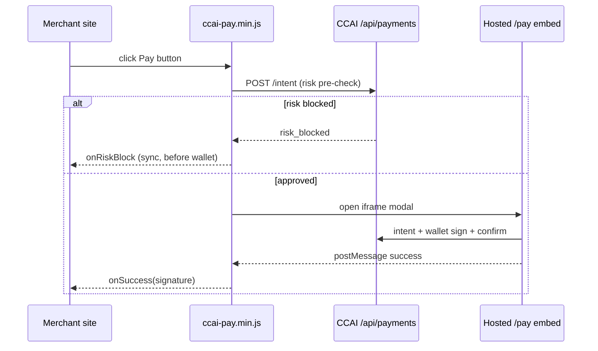

# CCAI Pay Button — Merchant Integration Guide

Embed a **Pay with CryptoCheck AI** button on any website. Payments are risk-verified on CCAI infrastructure before the wallet is prompted — your server is not required for checkout.

---

## Step 1 — Get your merchant wallet address

Use a Solana wallet you control as the payout destination.

Optional but recommended: register as a merchant so you get a display name and payment history.

```bash
curl -X POST https://www.cryptocheckai.com/api/payments/merchant \
  -H 'Content-Type: application/json' \
  -d '{
    "walletAddress": "YOUR_WALLET",
    "merchantName": "My Store",
    "webhookUrl": "https://your-site.com/webhooks/ccai"
  }'
```

---

## Step 2 — Add the script tag

Host the bundle from CDN (production) or your own static host:

```html
<script src="https://cdn.cryptocheckai.com/pay/v1/ccai-pay.min.js"></script>
```

For local development, build the package and serve `packages/ccai-pay/dist/ccai-pay.min.js`:

```bash
npm run build --prefix packages/ccai-pay
```

---

## Step 3 — Initialize `CCAIPay`

```html
<div id="pay-btn"></div>

<script>
  const pay = new CCAIPay({
    merchantWallet: 'YOUR_SOLANA_WALLET',
    chain: 'solana',
    // baseUrl: 'https://www.cryptocheckai.com', // optional override
  })

  pay.createButton(document.getElementById('pay-btn'), {
    amount: 50,
    token: 'USDC',
    memo: 'order-1042',
    onSuccess: (result) => {
      console.log('Paid!', result.signature)
      // Fulfill order, redirect to thank-you page, etc.
    },
    onRiskBlock: (reason) => {
      console.warn('Blocked before wallet:', reason)
    },
    onError: (err) => {
      console.error(err.message)
    },
  })
</script>
```

### Modal checkout (no inline button)

```javascript
pay.openPaymentModal({
  token: 'USDC',
  onSuccess: (r) => console.log(r.signature),
})
```

When `amount` is omitted, the customer enters it inside the hosted checkout iframe.

---

## Step 4 — Handle `onSuccess`

`onSuccess` receives the on-chain transaction signature:

```javascript
onSuccess: ({ signature, intentId }) => {
  fetch('/api/orders/fulfill', {
    method: 'POST',
    headers: { 'Content-Type': 'application/json' },
    body: JSON.stringify({ signature, intentId }),
  })
}
```

Verify the payment server-side by checking the Solana transaction (recipient, amount, token mint) before shipping goods.

Explorer link: `https://solscan.io/tx/<signature>`

---

## Step 5 — Test on devnet

1. Deploy or point `baseUrl` at your dev/staging host.
2. Register a devnet merchant wallet.
3. Use a devnet-capable wallet adapter on the hosted `/pay/<wallet>?embed=true` page.
4. Run a small USDC/SOL test payment.
5. Confirm `onSuccess` fires and the intent status is `confirmed` via:

```bash
curl "https://www.cryptocheckai.com/api/payments/intent?id=pi_..."
```

---

## Step 6 — Go live

1. Switch `baseUrl` to `https://www.cryptocheckai.com` (default).
2. Use mainnet wallet + mainnet tokens (`USDC`, `USDT`, or `SOL`).
3. Pin the CDN script URL with a version path (`/pay/v1/`) for cache stability.
4. Monitor merchant payments: `GET /api/payments/merchant/payments?wallet=YOUR_WALLET`

---

## Integration examples

### Static HTML

```html
<!DOCTYPE html>
<html lang="en">
<head>
  <meta charset="utf-8" />
  <title>Checkout</title>
  <script src="https://cdn.cryptocheckai.com/pay/v1/ccai-pay.min.js"></script>
</head>
<body>
  <h1>Checkout — $25.00</h1>
  <div id="ccai-pay"></div>
  <script>
    new CCAIPay({ merchantWallet: 'MERCHANT_WALLET', chain: 'solana' })
      .createButton(document.getElementById('ccai-pay'), {
        amount: 25,
        token: 'USDC',
        onSuccess: (r) => { window.location.href = '/thanks?tx=' + r.signature }
      })
  </script>
</body>
</html>
```

### React

```tsx
import { useEffect, useRef } from 'react'

declare global {
  interface Window {
    CCAIPay: new (config: { merchantWallet: string; chain: 'solana' }) => {
      createButton: (el: HTMLElement, opts: Record<string, unknown>) => Promise<void>
    }
  }
}

export function CheckoutPayButton({ wallet }: { wallet: string }) {
  const ref = useRef<HTMLDivElement>(null)

  useEffect(() => {
    if (!ref.current || !window.CCAIPay) return
    const pay = new window.CCAIPay({ merchantWallet: wallet, chain: 'solana' })
    void pay.createButton(ref.current, {
      amount: 49,
      token: 'USDC',
      onSuccess: ({ signature }) => console.log(signature),
    })
  }, [wallet])

  return <div ref={ref} />
}
```

Load the script in `index.html` or via `next/script`.

### Next.js (App Router)

```tsx
// app/checkout/page.tsx
'use client'

import Script from 'next/script'
import { useRef, useEffect } from 'react'

export default function CheckoutPage() {
  const host = useRef<HTMLDivElement>(null)

  useEffect(() => {
    if (!host.current || typeof window === 'undefined' || !(window as any).CCAIPay) return
    const CCAIPay = (window as any).CCAIPay
    const pay = new CCAIPay({
      merchantWallet: process.env.NEXT_PUBLIC_MERCHANT_WALLET!,
      chain: 'solana',
    })
    void pay.createButton(host.current, { amount: 10, token: 'USDC' })
  }, [])

  return (
    <>
      <Script src="https://cdn.cryptocheckai.com/pay/v1/ccai-pay.min.js" strategy="afterInteractive" />
      <div ref={host} />
    </>
  )
}
```

Alternatively, use the hosted iframe embed from the [merchant payment link dashboard](/dashboard/payments/link) — no script required.

### Shopify (theme liquid)

Add to `theme.liquid` before `</body>`:

```liquid
<script src="https://cdn.cryptocheckai.com/pay/v1/ccai-pay.min.js"></script>
<div id="ccai-pay-checkout"></div>
<script>
  document.addEventListener('DOMContentLoaded', function () {
    if (typeof CCAIPay === 'undefined') return
    var pay = new CCAIPay({
      merchantWallet: '{{ settings.ccai_merchant_wallet }}',
      chain: 'solana'
    })
    pay.createButton(document.getElementById('ccai-pay-checkout'), {
      amount: {{ cart.total_price | divided_by: 100.0 }},
      token: 'USDC',
      memo: 'shopify-{{ cart.token }}',
      onSuccess: function (r) {
        window.location.href = '/pages/thank-you?tx=' + r.signature
      }
    })
  })
</script>
```

Add a theme setting `ccai_merchant_wallet` in `settings_schema.json`.

---

## How it works



- **Zero runtime dependencies** — vanilla JS, no bundler required.
- **Hosted checkout** — wallet signing runs on CCAI; merchant site downtime does not block an in-flight intent.
- **Risk-first** — fixed-amount buttons call `/api/payments/intent` before opening the wallet UI; `onRiskBlock` fires before any wallet interaction.

---

## API reference

| Option | Type | Description |
|--------|------|-------------|
| `merchantWallet` | `string` | Required payout wallet |
| `chain` | `'solana' \| 'ethereum' \| 'base'` | `solana` supported today |
| `baseUrl` | `string` | CCAI host (default production URL) |
| `apiKey` | `string` | Optional; reserved for partner attribution |
| `amount` | `number` | Fixed USD amount; omit for customer entry |
| `token` | `'SOL' \| 'USDC' \| 'USDT'` | Default `USDC` |
| `memo` | `string` | Attached to payment intent |
| `onSuccess` | `(result) => void` | On-chain signature |
| `onRiskBlock` | `(reason) => void` | Risk engine blocked payment |
| `onError` | `(error) => void` | Network or payment failure |

---

## Build from source

```bash
cd packages/ccai-pay
npm install
npm run build
# → dist/ccai-pay.min.js (< 50 KB gzip target)
```

Publish `dist/ccai-pay.min.js` to `cdn.cryptocheckai.com/pay/v1/`.
